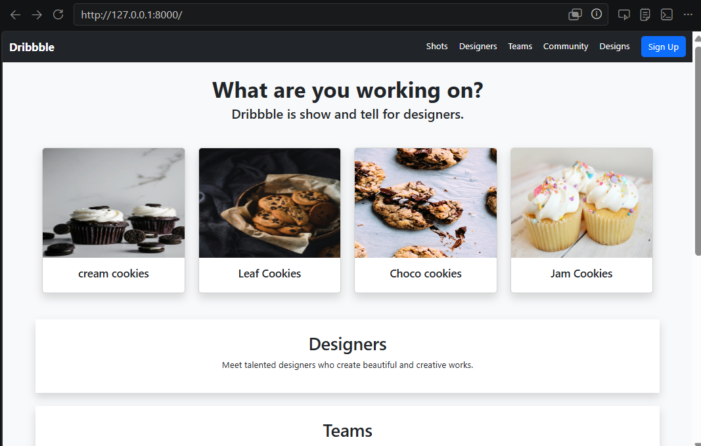
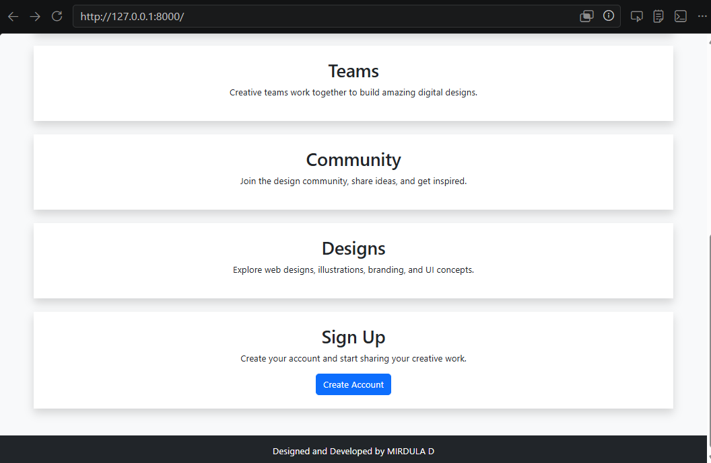
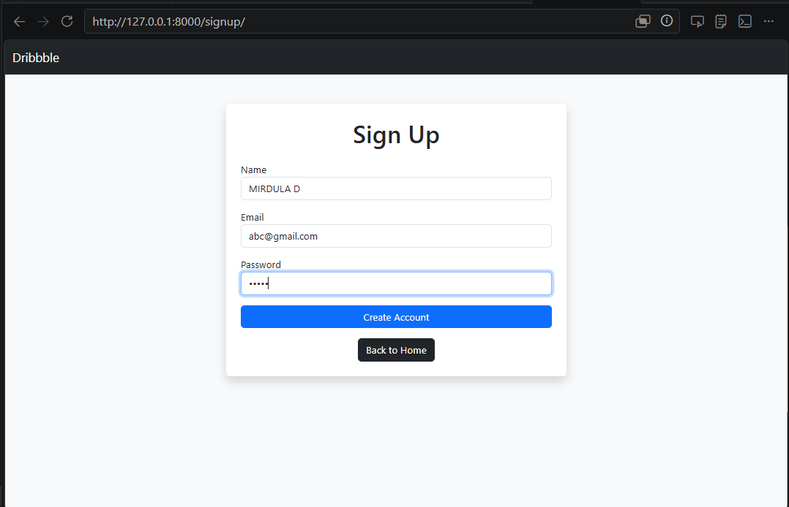
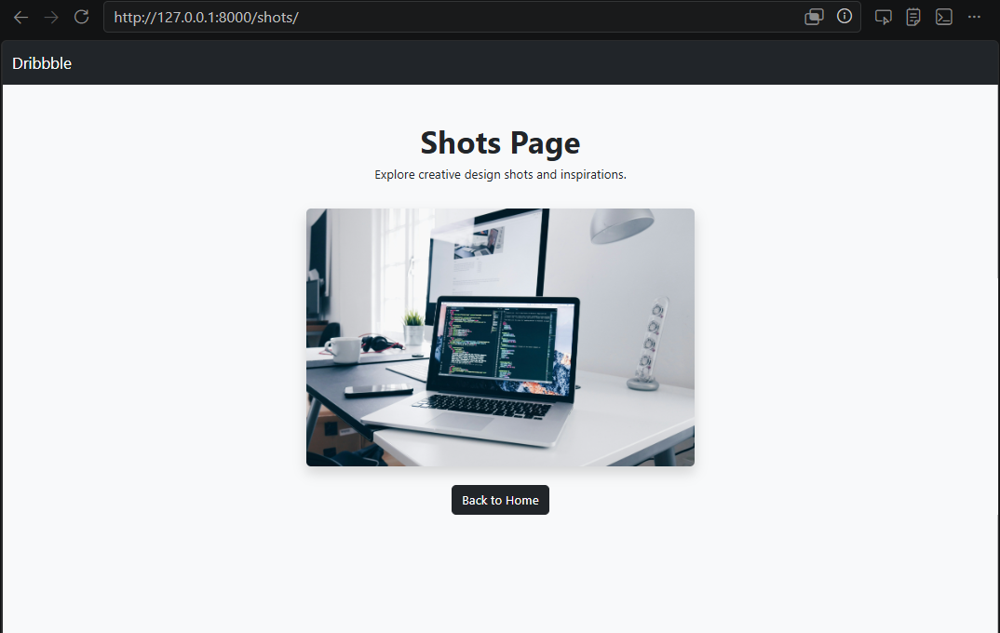
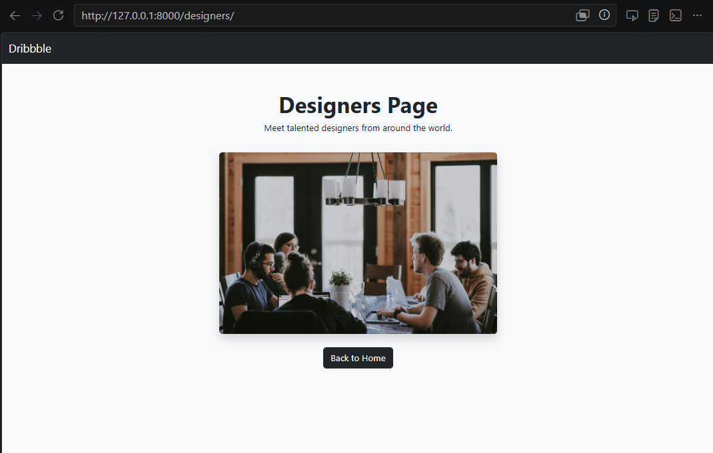
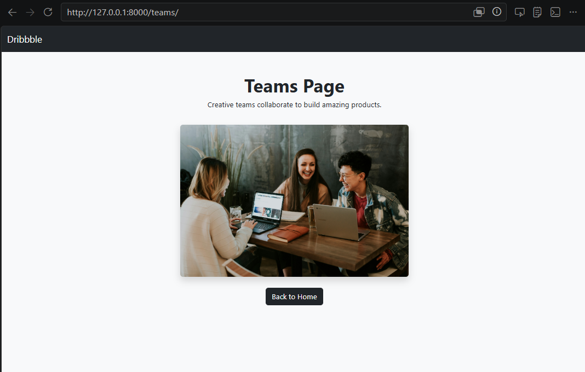
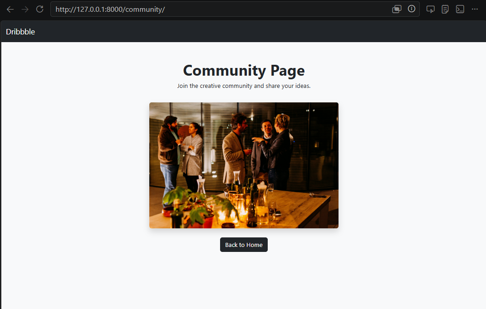
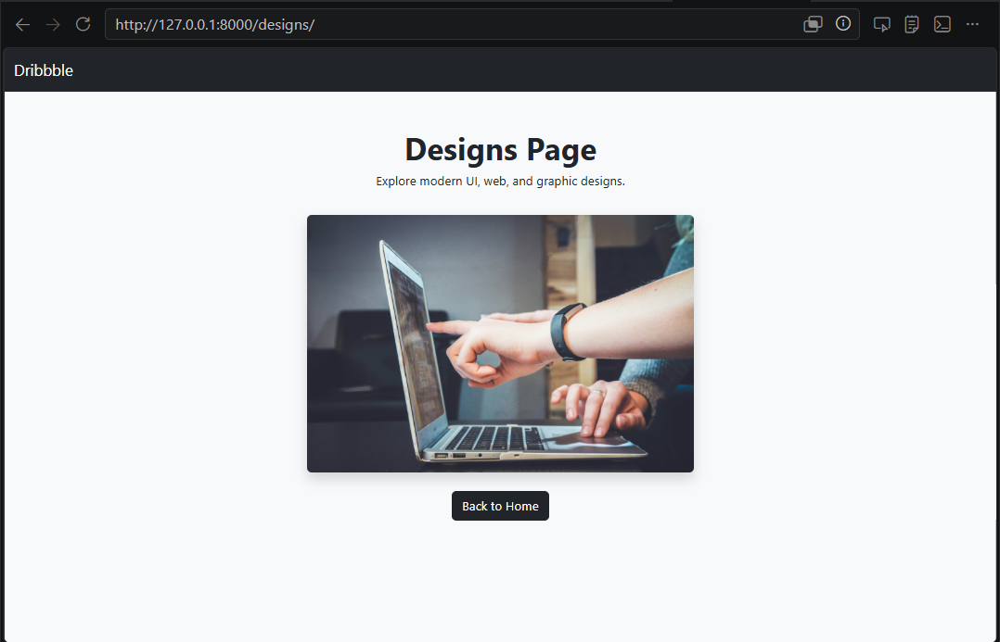

# Case Study: Dribble Clone
## Date:

## AIM:
To create a simplified clone of Dribbble (https://dribbble.com/) landing page.


## DESIGN STEPS:

### Step 1:
Clone the repository from GitHub.

### Step 2:
Create Django Admin project.

### Step 3:
Create a New App under the Django Admin project.

### Step 4:
Design a navigation bar with links: Inspiration, Find Work, Learn Design, Go Pro, Sign In, Sign Up.

### Step 5:
Add a catchy headline with a search bar.

### Step 6:
Use ```<div>``` containers for each dribbble shot thumbnail.

### Step 7:
Include designer name and likes count below each image.

### Step 8:
Include text like “Find your next design inspiration” with a button (“Join Dribbble” or “Explore”).

### Step 9:
Create a footer with your name and register number.

### Step 10:
Publish the website in the LocalHost.

## PROGRAM :
index.html
```
<!DOCTYPE html>
<html>
<head>
    <title>Dribbble Clone</title>
    <link href="https://cdn.jsdelivr.net/npm/bootstrap@5.3.3/dist/css/bootstrap.min.css" rel="stylesheet">
</head>

<body class="bg-light">

<nav class="navbar navbar-expand-lg navbar-dark bg-dark">
    <div class="container-fluid">

        <a class="navbar-brand fw-bold" href="/">Dribbble</a>

        <div class="ms-auto">

            <a href="/shots/" class="text-white text-decoration-none me-3">Shots</a>

            <a href="/designers/" class="text-white text-decoration-none me-3">Designers</a>

            <a href="/teams/" class="text-white text-decoration-none me-3">Teams</a>

            <a href="/community/" class="text-white text-decoration-none me-3">Community</a>

            <a href="/designs/" class="text-white text-decoration-none me-3">Designs</a>

            <a href="/signup/" class="btn btn-primary">Sign Up</a>

        </div>

    </div>
</nav>
<section id="shots" class="container text-center mt-4">
    <h1 class="fw-bold">What are you working on?</h1>
    <h4>Dribbble is show and tell for designers.</h4>
</section>

<section class="container mt-5">
    <div class="row g-4">

        <div class="col-md-3">
            <div class="card shadow">
                
                <div class="card-body text-center"><h5>cream cookies</h5></div>
            </div>
        </div>

        <div class="col-md-3">
            <div class="card shadow">
                
                <div class="card-body text-center"><h5>Leaf Cookies</h5></div>
            </div>
        </div>

        <div class="col-md-3">
            <div class="card shadow">
                
                <div class="card-body text-center"><h5>Choco cookies</h5></div>
            </div>
        </div>

        <div class="col-md-3">
            <div class="card shadow">
                
                <div class="card-body text-center"><h5>Jam Cookies</h5></div>
            </div>
        </div>

    </div>
</section>

<section id="designers" class="container text-center mt-5 p-4 bg-white shadow">
    <h2>Designers</h2>
    <p>Meet talented designers who create beautiful and creative works.</p>
</section>

<section id="teams" class="container text-center mt-4 p-4 bg-white shadow">
    <h2>Teams</h2>
    <p>Creative teams work together to build amazing digital designs.</p>
</section>

<section id="community" class="container text-center mt-4 p-4 bg-white shadow">
    <h2>Community</h2>
    <p>Join the design community, share ideas, and get inspired.</p>
</section>

<section id="designs" class="container text-center mt-4 p-4 bg-white shadow">
    <h2>Designs</h2>
    <p>Explore web designs, illustrations, branding, and UI concepts.</p>
</section>

<section id="signup" class="container text-center mt-4 p-4 bg-white shadow">
    <h2>Sign Up</h2>
    <p>Create your account and start sharing your creative work.</p>
    <button class="btn btn-primary">Create Account</button>
</section>

<footer class="bg-dark text-white text-center p-3 mt-5">
    Designed and Developed by MIRDULA D
</footer>

</body>
</html>
```

signup.html
```
<!DOCTYPE html>
<html>
<head>
    <title>Sign Up</title>

    <link href="https://cdn.jsdelivr.net/npm/bootstrap@5.3.3/dist/css/bootstrap.min.css" rel="stylesheet">
</head>

<body class="bg-light">

<nav class="navbar navbar-dark bg-dark">
    <div class="container-fluid">
        <a class="navbar-brand" href="/">Dribbble</a>
    </div>
</nav>

<div class="container mt-5">

    <div class="col-md-6 mx-auto bg-white p-4 shadow rounded">

        <h1 class="text-center mb-4">Sign Up</h1>

        <form>

            <div class="mb-3">
                <label>Name</label>
                <input type="text" class="form-control">
            </div>

            <div class="mb-3">
                <label>Email</label>
                <input type="email" class="form-control">
            </div>

            <div class="mb-3">
                <label>Password</label>
                <input type="password" class="form-control">
            </div>

            <button class="btn btn-primary w-100">Create Account</button>

        </form>

        <div class="text-center mt-3">
            <a href="/" class="btn btn-dark">Back to Home</a>
        </div>

    </div>

</div>

</body>
</html>
```
shots.html
```
<!DOCTYPE html>
<html>
<head>
    <title>Shots</title>

    <link href="https://cdn.jsdelivr.net/npm/bootstrap@5.3.3/dist/css/bootstrap.min.css" rel="stylesheet">
</head>

<body class="bg-light">

<nav class="navbar navbar-dark bg-dark">
    <div class="container-fluid">
        <a class="navbar-brand" href="/">Dribbble</a>
    </div>
</nav>

<div class="container text-center mt-5">

    <h1 class="fw-bold">Shots Page</h1>

    <p>Explore creative design shots and inspirations.</p>

    

    <br><br>

    <a href="/" class="btn btn-dark">Back to Home</a>

</div>

</body>
</html>
```

teams.html
```
<!DOCTYPE html>
<html>
<head>
    <title>Teams</title>

    <link href="https://cdn.jsdelivr.net/npm/bootstrap@5.3.3/dist/css/bootstrap.min.css" rel="stylesheet">
</head>

<body class="bg-light">

<nav class="navbar navbar-dark bg-dark">
    <div class="container-fluid">
        <a class="navbar-brand" href="/">Dribbble</a>
    </div>
</nav>

<div class="container text-center mt-5">

    <h1 class="fw-bold">Teams Page</h1>

    <p>Creative teams collaborate to build amazing products.</p>

    

    <br><br>

    <a href="/" class="btn btn-dark">Back to Home</a>

</div>

</body>
</html>
```

designs.html

```
<!DOCTYPE html>
<html>
<head>
    <title>Designs</title>

    <link href="https://cdn.jsdelivr.net/npm/bootstrap@5.3.3/dist/css/bootstrap.min.css" rel="stylesheet">
</head>

<body class="bg-light">

<nav class="navbar navbar-dark bg-dark">
    <div class="container-fluid">
        <a class="navbar-brand" href="/">Dribbble</a>
    </div>
</nav>

<div class="container text-center mt-5">

    <h1 class="fw-bold">Designs Page</h1>

    <p>Explore modern UI, web, and graphic designs.</p>

    

    <br><br>

    <a href="/" class="btn btn-dark">Back to Home</a>

</div>

</body>
</html>
```

designers.html

```
<!DOCTYPE html>
<html>
<head>
    <title>Designers</title>

    <link href="https://cdn.jsdelivr.net/npm/bootstrap@5.3.3/dist/css/bootstrap.min.css" rel="stylesheet">
</head>

<body class="bg-light">

<nav class="navbar navbar-dark bg-dark">
    <div class="container-fluid">
        <a class="navbar-brand" href="/">Dribbble</a>
    </div>
</nav>

<div class="container text-center mt-5">

    <h1 class="fw-bold">Designers Page</h1>

    <p>Meet talented designers from around the world.</p>

    

    <br><br>

    <a href="/" class="btn btn-dark">Back to Home</a>

</div>

</body>
</html>
```

community.html

```
<!DOCTYPE html>
<html>
<head>
    <title>Community</title>

    <link href="https://cdn.jsdelivr.net/npm/bootstrap@5.3.3/dist/css/bootstrap.min.css" rel="stylesheet">
</head>

<body class="bg-light">

<nav class="navbar navbar-dark bg-dark">
    <div class="container-fluid">
        <a class="navbar-brand" href="/">Dribbble</a>
    </div>
</nav>

<div class="container text-center mt-5">

    <h1 class="fw-bold">Community Page</h1>

    <p>Join the creative community and share your ideas.</p>

    

    <br><br>

    <a href="/" class="btn btn-dark">Back to Home</a>

</div>

</body>
</html>
```

## OUTPUT:










DEVELOPED BY: MIRDULA D

REGISTRATION NO. 212225040234


## RESULT:
The project for responsive web design in creating a clone of dribble.com is completed successfully.
